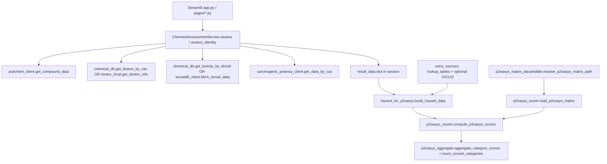

# Subroutine catalog and call graph (GHhaz5 Quick Hazard Assessment)

This document maps the **main computational subroutines** in `quick-hazard-assessment-app/` and how they connect for:

1. **Chemical assessment** (PubChem + DSSTox + ToxVal + CPDB),
2. **Hazard assembly for P2OASys** (`hazard_data`),
3. **P2OASys scoring** (matrix load + category scores + rollups).

It is not an exhaustive line-by-line inventory of every Streamlit callback or UI helper; see `pages/` and `app.py` for presentation logic.

Physical database and lookup file provenance are listed separately in  
`../../databases/DATABASE_CATALOG.md`.

---

## 1. End-to-end flow (runtime)

**Where `extra_sources` is built (two patterns):**

| Path | Entry | Merges into `hazard_data` via |
|------|--------|-------------------------------|
| **Streamlit P2OASys tab** | `app.py` (inline): loads IARC / ODP+GWP / atmo IPCC caches, optional `unified_lookup` + `build_extra_sources_from_iuclid_unified` | `hazard_for_p2oasys.merge_extra_sources` then `hazard_for_p2oasys.build_hazard_data` |
| **Headless / parity** | `utils/p2oasys_extras_merge.merge_extra_sources_for_cas` | Same merge helpers; used e.g. by GHhaz4 calibration scripts mirrored here |

---

## 2. Layer A — UI and orchestration

| Module | Key routines | Role | Calls into |
|--------|----------------|------|------------|
| `app.py` | Tab layout, session state, “Assess” handlers | User entry; wires services and utils | `services.chemical_assessment`, `utils.hazard_for_p2oasys`, `utils.p2oasys_scorer`, `utils.lookup_tables`, `utils.atmo_gwp`, `utils.iarc_lookup`, `utils.p2oasys_matrix_placeholder`, `utils.p2oasys_aggregate`, optional `utils.iuclid_p2oasys_bridge` |
| `pages/*.py` | Page-specific `main()` | Cross-validate, offline tests, etc. | Same stack as needed per page |

---

## 3. Layer B — Chemical identity and assessment

| Module | Key routines | Role | Calls into |
|--------|----------------|------|------------|
| `services/chemical_assessment.py` | `ChemicalAssessmentService.__init__` | Chooses SQLite vs legacy DSSTox files | `utils.chemical_db.get_db_stats`, optional `utils.dsstox_local.load_dsstox_enhanced` |
| | `assess`, `assess_identity` | Public API: string / example / SDS → `AssessmentResult` | `_identify_chemical`, `_assess_single_identity` |
| | `_identify_chemical`, `_identify_from_string`, `_identify_from_sds` | Resolve CAS/name/PDF → `ChemicalIdentity` | `utils.cas_validator`, `utils.sds_parser.get_sds_parser`, SDS-specific parsers |
| | `_assess_single_identity` | Fetch all backend data for one identity | `chemical_db` / `dsstox_local`, `pubchem_client`, `toxvaldb_client`, `carcinogenic_potency_client` |
| | `to_result_data` | Shape for legacy UI (`result_data`) | Pure dict assembly |
| | `get_assessment_service` | `@st.cache_resource` singleton | — |

**Downstream data contracts**

- `AssessmentResult.pubchem_data` → consumed by `hazard_for_p2oasys.pubchem_to_hazard_data`.
- `AssessmentResult.toxval_data` → `_toxval_to_toxicities` inside `hazard_for_p2oasys`.
- `AssessmentResult.carc_potency_data` → `_carc_potency_to_toxicities`.

---

## 4. Layer C — Optional extras before P2OASys

| Module | Key routines | Role | Called by |
|--------|----------------|------|-----------|
| `utils/lookup_tables.py` | `load_iarc_csv`, `load_odp_gwp_csv` | Load optional CSV lookups | `app.py`, `p2oasys_extras_merge._lookup_cache_load` |
| | `get_lookup_extra_sources` | Build `extra_sources` fragment (IARC string in `toxicities`; ODP/GWP strings in `hazard_metrics.other_designations`) | `app.py`, `p2oasys_extras_merge` |
| | `_normalize_cas_for_lookup` | Digits-only CAS key | Internal |
| `utils/iarc_lookup.py` | `load_iarc_from_iarc_folder` | Load IARC from `IARC_DIR` CSV/XLSX | `p2oasys_extras_merge._lookup_cache_load`, optionally `app.py` pattern |
| `utils/atmo_gwp.py` | `load_ipcc_gwp_100_from_atmo` | IPCC AR6/AR5/AR4 GWP from parquet in `ATMO_DIR` | `app.py`, `p2oasys_extras_merge._lookup_cache_load` |
| `utils/p2oasys_extras_merge.py` | `get_offline_ctx`, `_offline_ctx_singleton` | Lazy `OfflineDataContext` for IUCLID | `merge_extra_sources_for_cas` |
| | `_lookup_cache_load` | One-time cache: IARC folder or CSV, ODP/GWP CSV, atmo parquet | `merge_extra_sources_for_cas` |
| | `merge_extra_sources_for_cas` | **Single-CAS** parity merge: lookups + IUCLID | External scripts; pattern matches `app.py` |
| `unified_hazard_report/unified_lookup.py` | `unified_lookup` | CAS → dossier payload (offline) | `app.py`, `p2oasys_extras_merge` |
| `unified_hazard_report/data_context.py` | `OfflineDataContext` | Filesystem-backed IUCLID context | `get_offline_ctx` |
| `utils/iuclid_p2oasys_bridge.py` | `build_extra_sources_from_iuclid_unified` | IUCLID rows → `extra_sources` (acute conservatism, GHS hints, flash/VP) | `app.py`, `p2oasys_extras_merge` |
| | `_collect_from_normalized_row`, `_collect_from_raw_endpoint_row`, `_flash_vp_from_rows`, `_h_codes_from_cl_rows`, … | Parsing helpers | `build_extra_sources_from_iuclid_unified` |

---

## 5. Layer D — `hazard_data` assembly

| Module | Key routines | Role | Called by |
|--------|----------------|------|-----------|
| `utils/hazard_for_p2oasys.py` | `pubchem_to_hazard_data` | PubChem JSON → `hazard_data` skeleton | `build_hazard_data` |
| | `_toxval_to_toxicities`, `_carc_potency_to_toxicities` | DB/API toxicity → scorer `toxicities` list | `build_hazard_data` |
| | `build_hazard_data` | **Merge** PubChem + ToxVal + CPDB + `extra_sources` | `app.py`, scripts |
| | `merge_extra_sources` | Deep-merge two `extra_sources` dicts (IUCLID on top of lookups) | `app.py`, `p2oasys_extras_merge` |
| | `_empty_hazard_data` | Default empty structure | `pubchem_to_hazard_data`, `build_hazard_data` |

**Data shape** (input to scorer): `dict` with keys `ghs`, `toxicities`, `hazard_metrics` (`flash_point`, `nfpa`, `other_designations`), optional `cid`.

---

## 6. Layer E — P2OASys matrix and scoring

| Module | Key routines | Role | Called by |
|--------|----------------|------|-----------|
| `utils/p2oasys_matrix_placeholder.py` | `resolve_p2oasys_matrix_path` | Official matrix vs dev placeholder | `app.py`, validation scripts |
| `utils/p2oasys_scorer.py` | `load_p2oasys_matrix` | Read Excel sheets → internal rule tree | `app.py`, batch validators |
| | `_parse_sheet`, `_build_rule`, `_parse_numeric_threshold` | Matrix parsing | `load_p2oasys_matrix` |
| | `_extract_ld50_oral`, `_extract_lc50_inhalation`, `_extract_flash_point_c`, `_extract_iarc`, … | Pull normalized values from `hazard_data` | `compute_p2oasys_scores` |
| | `_score_numeric`, `_score_ghs_h`, `_score_phrase`, `_score_text` | Match one matrix unit to a 2–10 score | `compute_p2oasys_scores` |
| | `_category_score_mean_top_two_subcategories` | Official category rollup (mean of two highest subcategory maxima) | `compute_p2oasys_scores` |
| | `compute_p2oasys_scores` | **Main scorer**: returns per-category dicts with `_category_max` and subcategory detail | `app.py`, `scripts/validate_p2oasys_vs_fast_reference.py`, etc. |
| | `print_p2oasys_summary` | Debug / CLI helper | Ad hoc |
| `utils/p2oasys_aggregate.py` | `aggregate_category_scores` | Roll categories to one number (`max` / `mean` / `weighted_mean`) | `app.py` |
| | `count_scored_categories` | Coverage metric | `app.py` |

**Matrix sheet → P2OASys category names** are defined in `p2oasys_scorer.SHEET_CATEGORIES` (e.g. `"Acute "` → `"Acute Human Effects"`).

---

## 7. Layer F — OPERA (parallel branch)

Used for precomputed QSAR-style endpoints and validation; **not** on the minimal PubChem→P2OASys path unless wired in a page or script.

| Module | Role |
|--------|------|
| `utils/opera_client.py` | HTTP / CLI client to local OPERA |
| `utils/opera_batch.py`, `utils/opera_precompute_worker.py`, `utils/opera_precompute_cache.py` | Batch runs and SQLite cache |
| `utils/opera_mapper.py` | Map OPERA output columns to internal conventions |
| `scripts/precompute_opera_for_cas_list.py` | Build `opera_precompute.sqlite` |
| `scripts/validate_opera_against_toxval.py`, `scripts/build_opera_toxval_mapping.py` | QA pipelines |

---

## 8. Layer G — SDS ingestion (parallel branch)

| Module | Role |
|--------|------|
| `utils/sds_parser.py` | Facade for SDS PDF parsing |
| `utils/robust_cas_extractor.py`, `utils/docling_sds_parser.py`, `parsers/ocr_pipeline.py` | CAS / text extraction pipelines |
| `utils/sds_pdf_utils.py`, `utils/sds_compare.py` | PDF utilities and comparisons |

These feed **identification** (`ChemicalAssessmentService`) or supplemental `extra_sources` when SDS-derived GHS is merged in downstream flows.

---

## 9. Layer H — Unified hazard report (offline dossiers)

| Module | Role |
|--------|------|
| `unified_hazard_report/main.py`, `report_generator.py`, `iuclid_extractor.py` | Broader report generation from IUCLID / offline trees |
| `unified_hazard_report/legacy_adapter.py` | Compatibility shims |

The **P2OASys-specific** narrow bridge is `utils/iuclid_p2oasys_bridge.py` → `hazard_for_p2oasys.merge_extra_sources`.

---

## 10. Quick reference: “who calls whom” for P2OASys scoring

1. **`ChemicalAssessmentService._assess_single_identity`**  
   → `pubchem_client` + DB/API clients → **`AssessmentResult`**.

2. **`hazard_for_p2oasys.build_hazard_data`**  
   ← `pubchem_data`, `toxval_data`, `carc_potency_data`, optional **`extra_sources`**.

3. **`extra_sources`** from any of:
   - **`lookup_tables.get_lookup_extra_sources`** (IARC / ODP+GWP CSV / atmo IPCC),
   - **`iuclid_p2oasys_bridge.build_extra_sources_from_iuclid_unified`** ← **`unified_lookup`**.

4. **`p2oasys_scorer.compute_p2oasys_scores`**  
   ← `hazard_data`, **matrix** from **`load_p2oasys_matrix`**.

5. **`p2oasys_aggregate`**  
   ← scores dict for overall summaries.

---

## 11. Related scripts (batch / validation)

| Script | Purpose |
|--------|---------|
| `scripts/validate_p2oasys_vs_fast_reference.py` | Compare app scores to reference CSV |
| `scripts/export_p2oasys_audit.py` | Export scoring audit trail |
| `scripts/run_full_validation.py` | Broader validation driver |
| `scripts/rebuild_iuclid_cache.py`, `scripts/inspect_iuclid_xml.py` | IUCLID maintenance |

---

*Last updated to reflect GHhaz5 `quick-hazard-assessment-app` layout and the merged ODP/GWP CSV schema (`gwp100_ar6` / `gwp100_fallback`) consumed by `lookup_tables.load_odp_gwp_csv`.*
